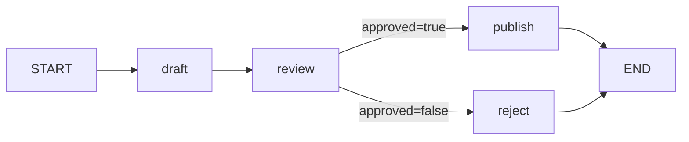

# LangGraph 的直接边与条件边

## 问题

在 LangGraph 中，什么时候应该使用直接 edge，什么时候才应该使用 conditional edge？

## 简短答案

如果一个节点完成后的后继集合固定，使用直接 edge；固定集合既可以是一个节点，也可以是
无条件并行执行的多个节点。如果必须根据 graph state 或节点结果从合法路径中选择，使用
conditional edge。不要为了“以后可能有分支”提前引入路由函数，也不要把真实业务分支藏进
节点内部后再接一条看似固定的边。

## 判断标准

| 问题 | 直接 edge | Conditional edge |
| --- | --- | --- |
| 后继集合 | 每次都相同；可为一个或固定并行多个 | 运行时从候选路径中选择 |
| 路径是否依赖 state | 不用 state 选择拓扑 | 依赖已写入 state 的判定结果 |
| 需要单独测试什么 | 节点成功后到达全部固定后继 | 每个 route 值及 route 到节点的映射 |
| 主要价值 | 显式表达固定流程，复杂度最低 | 把业务决策与节点执行分离并显式呈现 |

这里的“直接”不表示节点不会读写 state，也不表示只能串行；它只描述拓扑选择是固定的。
同样，“条件”不应由随机路由或难以复现的隐藏副作用决定，最好读取已经进入 graph state 的
明确字段。

## 当前审批示例如何选择边

[`examples/langgraph_workflow.py`](../../examples/langgraph_workflow.py) 表达下面的状态机：



### 固定步骤用直接 edge

- `START -> draft`：每次工作流都先生成草稿；
- `draft -> review`：草稿完成后总要进入审批；
- `publish -> END` 和 `reject -> END`：两个终态都固定结束。

这些路径没有需要计算的下一节点。若为它们写返回常量的 router，只会增加函数、映射和测试，
却不增加表达力。

### 真正的业务分支用 conditional edge

`request_review` 使用 `interrupt(...)` 暂停运行；恢复时把操作员决定写入
`state["approved"]`。随后 `route_review` 读取这个字段：

```python
def route_review(state: ReviewState) -> str:
    return "publish" if state["approved"] else "reject"
```

`add_conditional_edges` 再把 `publish` / `reject` 这两个 route 值映射到实际节点。两个后继都
是当前业务允许的路径，且选择依赖 state，因此条件边准确表达了拓扑。

## Interrupt 与 conditional edge 不是一回事

`interrupt` 回答“现在是否要暂停，并等待外部输入”；conditional edge 回答“拿到 state 后要去
哪个节点”。示例把两者组合起来，但也可以：

- interrupt 后固定进入同一个节点；
- 不 interrupt，仅根据自动计算的风险分数走条件边。

把暂停机制和路由机制分开理解，才能分别测试恢复状态与分支选择。

## 一个实用决策流程

1. 先写出当前节点所有合法后继，以及哪些后继应在每次执行中被触发。
2. 如果每次触发的后继集合都相同，使用 `add_edge`；固定 fan-out 可以连接多个并行节点。
3. 如果必须选择不同后继，指出决定路径的 state 字段或纯路由规则。
4. 每个 route 值都映射到明确节点，并为每条合法路径写测试。
5. 如果所谓分支只是在节点内部选择实现策略、但对 graph 生命周期没有可观察差异，保留一个
   节点即可，不必把内部 `if` 全部升级为 graph edge。

当异常意味着本次执行失败时，也不要为了吞掉异常而机械增加 conditional edge。只有“失败后
进入补偿/人工处理节点”本身是产品定义的合法状态转换时，它才应成为图上的分支。

## 当前实现与测试入口

- [`langgraph_workflow.py`](../../examples/langgraph_workflow.py)：固定 edge、审批条件 edge、
  checkpoint 与 interrupt/resume 的最小组合。
- [`test_examples.py`](../../tests/examples/test_examples.py)：分别验证 approved 与 rejected
  两个终态。
- [`learning-path.md`](../learning-path.md)：何时从高层 `create_agent` 下沉到 LangGraph 的
  学习场景。
