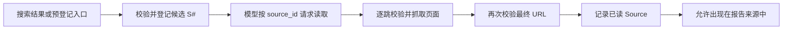

# 来源候选、已读证据与最终 URL

## 问题

搜索候选与已读证据有什么区别？页面发生重定向后，为什么必须重新验证最终 URL？为什么
页面标题要与正文证据分开保存？

## 简短答案

搜索候选只表示“这个 URL 可能值得读”，不能证明页面可访问、内容与摘要一致，也不能作为
最终报告来源。已读证据表示页面已经通过读取边界，且记录的是实际响应页面标题的受限表示、
最终 URL 和读取时间。HTML/XHTML 标题先作为元数据保存，再从正文提取树中排除，不能重复
消耗正文字符预算。重定向会改变真正访问的目标，因此每一跳和最终记录都必须重新通过公网
URL 校验；否则一个安全的起始 URL 可以把读取器带到本机、私网或其他未经批准的目标。

## 两种状态不是同一份数据

| 状态 | 数据从哪里来 | 已经证明什么 | 还不能证明什么 |
| --- | --- | --- | --- |
| 搜索候选 | 搜索 provider 或仓库内预登记目录 | URL 形式和解析结果通过登记时的公网校验；候选获得请求内 `S#` | 页面成功读取、摘要准确、最终位置安全、内容可支持回答 |
| 已读证据 | 页面读取器的实际响应 | 读取成功；最终页面再次通过校验；有实际页面标题的最多 500 字符前缀、完整最终 URL、`retrieved_at` | 页面中的每句话都可信，或它一定语义支持模型陈述 |

搜索摘要仍是 provider 提供的线索。即使候选来自仓库内核验过的官方目录，也必须经过相同的
`read_source` 流程；“预登记”只改善发现路径，不会把候选升级为证据。

### 候选数量与单项大小是两个资源维度

请求 provider 时传入 `max_results=5` 只是依赖调用参数；本地还会在 provider 返回后只取前
5 条，避免依赖忽略参数时扩大 registry 和模型工具结果。但只限制条数仍不足：一条结果也可以
携带极长 title 或 snippet。

因此所有搜索和预登记候选在写入模型可见 JSON 前都执行相同字段策略：title 最多 500 字符，
snippet 最多 2,000 字符；空 title 使用完整已验证 URL 的前 500 字符作为显示 fallback，而
`url` 字段和去重 identity 保持完整。预登记候选不受“五条”数量上限，但受相同单项字段上限。

这些都是 provider 已返回 Python 对象后的字符数限制。它们不能减少已经下载的响应、provider
内部已经分配的内存，也不是精确的 JSON byte 或模型 token 上限。候选字段仍只是发现线索；
成功读取后的 `Source.title` 来自实际页面的受限表示，不会用被截断的搜索标题冒充
provenance。

### 诊断失败也需要独立的输出边界

“操作已 fail closed”只说明失败不会被冒充成成功，不代表错误详情可以无限增长。搜索 provider
和页面 reader 的 exception text 会进入模型可见的工具 error JSON；无效搜索候选的原始 URL
会进入内部 warning；Agent exception 和工具 warnings 最终进入 `ResearchReport`，再由 JSON、
CLI 或 Streamlit 展示。若这些字符串没有自己的约束，一个安全失败仍可占满模型上下文或让
操作员输出不可用。

本项目因此把单条 warning 的稳定 domain 上限设为 2,000 字符。超限时保留尽可能长的原始
前缀，并把最后的空间留给精确标记 `... [truncated]`；上限内的内容完全不变。边界执行两次：

1. `ResearchTools` 在搜索/读取 error JSON 返回模型之前记录受限 warning；
2. `ResearchService` 在成功或 fail-closed `ResearchReport` 构造前再次适配所有 warning，覆盖
   Agent exception 和自定义 backend 直接添加诊断的路径。

`ResearchReport` 本身仍是严格契约：直接传入超过 2,000 字符的 warning 会验证失败，而不是在
domain 内静默修改。这与实际页面标题的 Page→Source 适配遵循相同分工——组合边界处理外部
变化，稳定 domain 拒绝未适配输入。CLI/eval 之后仍会处理 terminal controls，Streamlit 仍把
详情放在非 Markdown code element；字符上限没有替代这些 sink-specific 编码。

这是 per-item、provider/exception 已返回后的字符约束。格式化异常时 Python 可能已经持有完整
字符串；JSON 编码后的 byte 和模型 token 数也不等于字符数。当前没有限制 warning 条数，因此
“每项大小”和“集合基数”仍是两个不同资源维度。截断后的前缀适合定位常见错误，但不保证保留
原始详情末尾；若未来确实需要完整 stack 或 payload，应写入另一个受访问控制的本地诊断通道，
而不是重新放宽模型和用户报告边界。

本项目的状态转换如下：



`ResearchTools` 为每次研究请求维护两个独立集合：

- `_sources_by_id` / `_sources_by_url` 保存已登记候选；
- `_read_sources_by_id` 只保存成功读取后的 `Source`。

`read_source` 只接收已登记的 `source_id`，不接收模型直接给出的 URL。这把模型能选择的
动作限制为“读取已经过第一道校验的候选”，而不是“连接任意模型生成的地址”。读取成功后，
页面正文只在当前工具结果中交给模型；`ResearchReport.sources` 保存最终来源元数据，不持久化
网页正文。

## 为什么重定向必须重新验证

### 1. 重定向目标是一次新的网络授权决策

对 `https://public.example/start` 的校验只说明起始目标当时解析到公网地址。服务器仍可返回：

```text
Location: http://127.0.0.1:11434/api/tags
```

也可能跳到 RFC1918 私网、link-local 地址、云实例 metadata endpoint，或经过 DNS 变化后指向
非公网地址。若 HTTP client 自动跟随重定向而不重新检查，就会绕过起始 URL 的 SSRF 防线。

因此 `SafeHttpPageReader` 关闭 HTTPX 自动重定向，并在循环中对 `current_url` 每一跳调用
`target_validator`。校验返回允许连接的公网 IP；读取器固定连接到该 IP，同时保留原域名的
`Host` 和 TLS SNI，降低 DNS 重绑定风险。

### 2. 报告必须描述真正读到的资源

搜索结果的标题和 URL 可能只是旧地址、短链接或入口页。证据的 provenance 应回答：

- 最终读到哪个 URL；
- 响应页面实际给出的标题在 domain 允许范围内是什么；
- 什么时候读取的。

所以成功读取后，原来的 `S#` 身份保持稳定，但 `Source.title`、`Source.url` 和
`Source.retrieved_at` 来自最终页面，而不是搜索结果。Page→Source 边界把实际标题 strip 后
保留最多 500 字符；若标题为空，则保留最终 URL 的最多 500 字符作为显示 fallback，但
`Source.url` 仍保存完整 identity。这样外部元数据不会因超过稳定 domain contract 而让已成功
读取的正文丢失。直接构造超过 500 字符的 `Source.title` 仍会失败。未读候选不会出现在报告
来源列表中。

#### 标题元数据为什么不能占用正文证据预算

[WHATWG HTML Standard](https://html.spec.whatwg.org/multipage/semantics.html#the-title-element)
把 `head` 描述为文档元数据的集合，并把 `title` 定义为表示文档标题或名称的元数据；它还
明确指出页面标题可以不同于正文中的第一个 heading。本项目的数据模型也已经把两者拆成
`Page.title` 与 `Page.text`，因此正文抽取不应再把同一段 `title` 复制进 `Page.text`。

这不只是去重问题。`Page.text` 有字符上限；如果实现先对整个 HTML 调用 `get_text()`，再切取
前 N 个字符，一个很长的 `<title>` 可以独占窗口。比如正文是 `BODY_EVIDENCE`、标题有 100
个字符，而正文预算只有 20 个字符时，旧行为得到的是 20 个标题字符，模型完全看不到正文。

当前 HTML/XHTML 路径先读取 `soup.title`，随后从解析树移除整个 `head`，并额外移除可能位于
`head` 外的游离 `title`，最后才沿用现有的 script/style/noscript/svg/nav/footer 清理、换行
归一化与字符切片。结果是：

- `Page.title` 仍保存实际页面标题，后续在 Page→Source 边界适配到 500 字符 domain 上限；
- `Page.text` 的预算用于可见 body 文本，正文 heading 不会因为这次改动被删除；
- `text/plain` 不经过 HTML 树处理，只保持既有首尾空白清理与字符上限；
- 网络目标校验、重定向、媒体类型、响应字节上限和连接预算都没有变化。

这个规则只按 HTML 结构区分元数据与 body 文本。BeautifulSoup 对畸形 HTML 的修复仍是启发式
行为；实现没有判断 `main`/`article` 的语义优先级、CSS 可见性或内容相关性，也没有移除所有
导航和样板，更不构成 prompt-injection 防护。

#### 标题是证据元数据，不是可信 UI 标记

实际页面标题由远端站点控制。报告保存它在 domain 限制内的前缀，而不是搜索标题；但“来自
实际页面”不表示可以把该值原样送入每个渲染器。[Streamlit `st.link_button` 文档](https://docs.streamlit.io/develop/api-reference/widgets/st.link_button)
明确说明 `label` 支持 GFM Links 和 Images，因此即使真正的 `Source.url` 已放在独立 `url`
参数中，下面这个标题仍会给 label 引入第二个活动目标：

```text
Official [injected](https://attacker.example) 
```

UI 在构造来源按钮 label 时，对 `Source.title` 应用与答案正文相同的活动目标移除规则，只保留
可见 label 文本；如果标题只由目标组成，使用固定的 `Source`。按钮的 `url` 参数仍是经过验证
的最终来源 URL，`ResearchReport`、JSON 和 CLI 中已记录的标题都不改变。这是面向具体 GFM sink
的输出编码，不是对 provenance 的改写，也不声称提供通用 HTML sanitization。

### 3. 读取器与领域边界做了纵深校验

页面读取器会逐跳验证目标；`ResearchTools.read_source` 收到 `Page` 后还会对
`page.url` 再调用一次 URL validator，只有通过才创建 `Source`。前者保护实际连接，后者保护
写入报告的 provenance。任一校验或读取失败都会保留 warning，并且不会把该 `S#` 加入
`read_source_ids`。

## 一个可判定的例子

假设搜索返回两个候选 `S1` 和 `S2`：

1. `S1` 成功读取，并从 `/start` 重定向到 `/final`；
2. `S2` 从未读取；
3. 模型引用 `[S1]`。

成功报告只能列出 `S1`，并记录 `/final`。若模型引用 `[S2]`，研究服务会将结果判为
`invalid_report`；若最终 URL 转向非公网地址，`S1` 也不会成为已读证据。

## 当前实现与测试入口

- [`tools.py`](../../src/agent_learn/tools.py)：请求内候选登记、按 ID 读取、最终 URL 校验与已读集合。
- [`adapters.py`](../../src/agent_learn/adapters.py)：关闭自动重定向、逐跳验证、IP pinning 与页面解析。
- [`security.py`](../../src/agent_learn/security.py)：公网地址、DNS、Fake-IP 和 URL 安全规则。
- [`ui.py`](../../src/agent_learn/ui.py)：来源标题的 GFM destination 移除与参数化来源按钮。
- [`test_tools.py`](../../tests/unit/test_tools.py)：验证未读候选不会成为来源，且记录最终页面 provenance。
- [`test_adapters.py`](../../tests/unit/test_adapters.py)：验证重定向到私网目标会被拒绝。
- [`test_research.py`](../../tests/unit/test_research.py)：验证引用未读来源时 fail closed。
- [`test_app.py`](../../tests/ui/test_app.py)：验证远端标题不能为来源按钮增加链接或图片目标。
