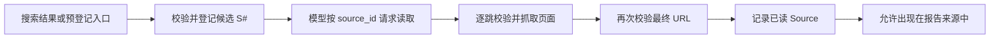

# 来源候选、已读证据与最终 URL

## 问题

搜索候选与已读证据有什么区别？页面发生重定向后，为什么必须重新验证最终 URL？

## 简短答案

搜索候选只表示“这个 URL 可能值得读”，不能证明页面可访问、内容与摘要一致，也不能作为
最终报告来源。已读证据表示页面已经通过读取边界，且记录的是实际响应页面的标题、最终 URL
和读取时间。重定向会改变真正访问的目标，因此每一跳和最终记录都必须重新通过公网 URL
校验；否则一个安全的起始 URL 可以把读取器带到本机、私网或其他未经批准的目标。

## 两种状态不是同一份数据

| 状态 | 数据从哪里来 | 已经证明什么 | 还不能证明什么 |
| --- | --- | --- | --- |
| 搜索候选 | 搜索 provider 或仓库内预登记目录 | URL 形式和解析结果通过登记时的公网校验；候选获得请求内 `S#` | 页面成功读取、摘要准确、最终位置安全、内容可支持回答 |
| 已读证据 | 页面读取器的实际响应 | 读取成功；最终页面再次通过校验；有实际标题、最终 URL、`retrieved_at` | 页面中的每句话都可信，或它一定语义支持模型陈述 |

搜索摘要仍是 provider 提供的线索。即使候选来自仓库内核验过的官方目录，也必须经过相同的
`read_source` 流程；“预登记”只改善发现路径，不会把候选升级为证据。

本项目的状态转换如下：



`ResearchTools` 为每次研究请求维护两个独立集合：

- `_sources_by_id` / `_sources_by_url` 保存已登记候选；
- `_read_sources_by_id` 只保存成功读取后的 `Source`。

`read_source` 只接收已登记的 `source_id`，不接收模型直接给出的 URL。这把模型能选择的
动作限制为“读取已经过第一道校验的候选”，而不是“连接任意模型生成的地址”。读取成功后，
页面正文只在当前工具结果中交给模型；`ResearchReport.sources` 保存最终来源元数据，不持久化
网页正文。

## 为什么重定向必须重新验证

### 1. 重定向目标是一次新的网络授权决策

对 `https://public.example/start` 的校验只说明起始目标当时解析到公网地址。服务器仍可返回：

```text
Location: http://127.0.0.1:11434/api/tags
```

也可能跳到 RFC1918 私网、link-local 地址、云实例 metadata endpoint，或经过 DNS 变化后指向
非公网地址。若 HTTP client 自动跟随重定向而不重新检查，就会绕过起始 URL 的 SSRF 防线。

因此 `SafeHttpPageReader` 关闭 HTTPX 自动重定向，并在循环中对 `current_url` 每一跳调用
`target_validator`。校验返回允许连接的公网 IP；读取器固定连接到该 IP，同时保留原域名的
`Host` 和 TLS SNI，降低 DNS 重绑定风险。

### 2. 报告必须描述真正读到的资源

搜索结果的标题和 URL 可能只是旧地址、短链接或入口页。证据的 provenance 应回答：

- 最终读到哪个 URL；
- 响应页面实际给出的标题是什么；
- 什么时候读取的。

所以成功读取后，原来的 `S#` 身份保持稳定，但 `Source.title`、`Source.url` 和
`Source.retrieved_at` 来自最终页面，而不是搜索结果。未读候选不会出现在报告来源列表中。

### 3. 读取器与领域边界做了纵深校验

页面读取器会逐跳验证目标；`ResearchTools.read_source` 收到 `Page` 后还会对
`page.url` 再调用一次 URL validator，只有通过才创建 `Source`。前者保护实际连接，后者保护
写入报告的 provenance。任一校验或读取失败都会保留 warning，并且不会把该 `S#` 加入
`read_source_ids`。

## 一个可判定的例子

假设搜索返回两个候选 `S1` 和 `S2`：

1. `S1` 成功读取，并从 `/start` 重定向到 `/final`；
2. `S2` 从未读取；
3. 模型引用 `[S1]`。

成功报告只能列出 `S1`，并记录 `/final`。若模型引用 `[S2]`，研究服务会将结果判为
`invalid_report`；若最终 URL 转向非公网地址，`S1` 也不会成为已读证据。

## 当前实现与测试入口

- [`tools.py`](../../src/agent_learn/tools.py)：请求内候选登记、按 ID 读取、最终 URL 校验与已读集合。
- [`adapters.py`](../../src/agent_learn/adapters.py)：关闭自动重定向、逐跳验证、IP pinning 与页面解析。
- [`security.py`](../../src/agent_learn/security.py)：公网地址、DNS、Fake-IP 和 URL 安全规则。
- [`test_tools.py`](../../tests/unit/test_tools.py)：验证未读候选不会成为来源，且记录最终页面 provenance。
- [`test_adapters.py`](../../tests/unit/test_adapters.py)：验证重定向到私网目标会被拒绝。
- [`test_research.py`](../../tests/unit/test_research.py)：验证引用未读来源时 fail closed。
