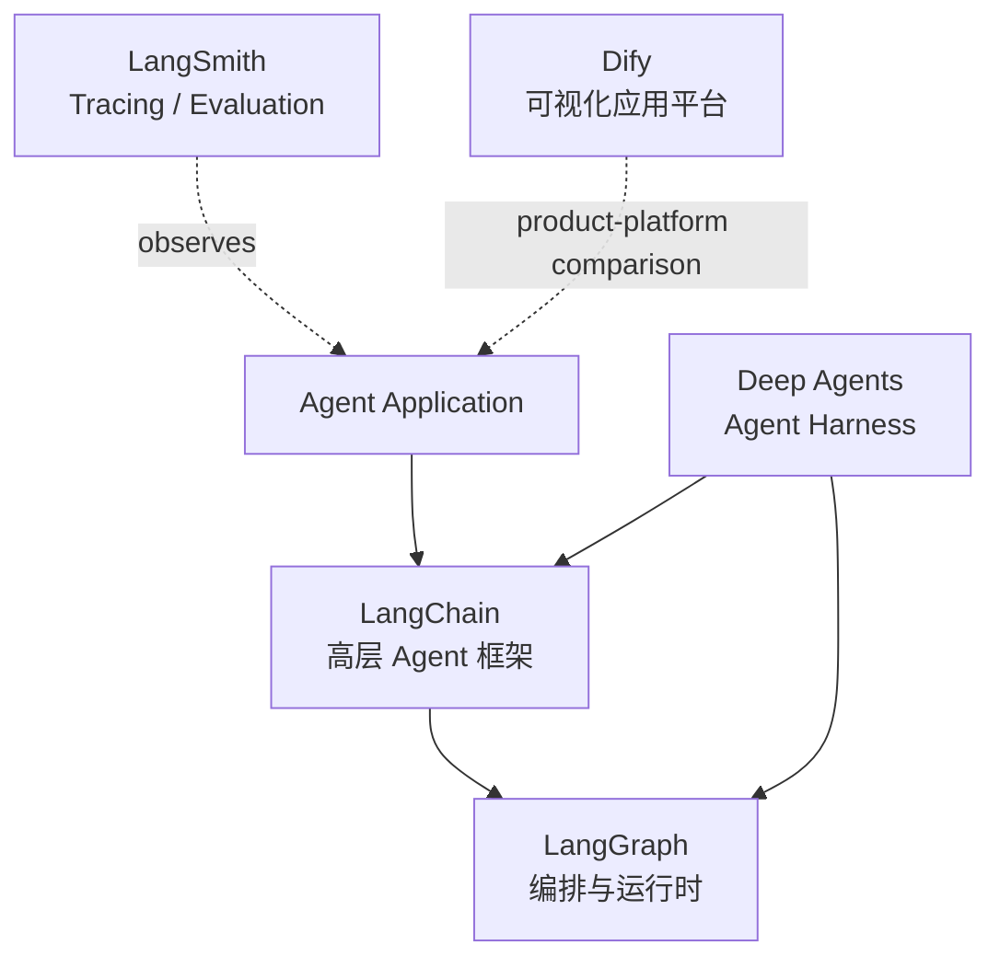

# LangChain 生态地图

资料核验日期：2026-07-18。学习时优先使用官方 v1 文档；版本边界变化时重新核验。

| 组件 | 核心职责 | 什么时候使用 |
| --- | --- | --- |
| LangChain | `create_agent`、模型、工具、middleware 等高层抽象 | 标准工具型 Agent，需要快速开始并保留代码控制 |
| LangGraph | state、node、edge、checkpoint、interrupt 等低层编排 | 长时、有状态、需要确定性分支、持久化或 HITL |
| LangSmith | trace、dataset、experiment、evaluation | 需要解释调用链、回归测试和质量评测 |
| Deep Agents | 规划、文件系统、子 Agent、上下文管理 | 复杂、长时、开放式任务需要更完整的 harness |
| Dify | 可视化 Workflow、RAG、应用发布和管理 | 快速低代码产品化；它不是 LangChain 组件 |

## Go 生态对照

- Eino：Go 原生组件、Graph/Workflow 与 Agent ADK。
- tRPC-Agent-Go：Go Agent runtime，覆盖 multi-agent、memory、RAG、MCP 与 telemetry。
- Coze Studio：Go 后端 + TypeScript 前端的一体化可视化 Agent 平台。
- LangChainGo：社区维护的 LangChain 风格 Go 实现。
